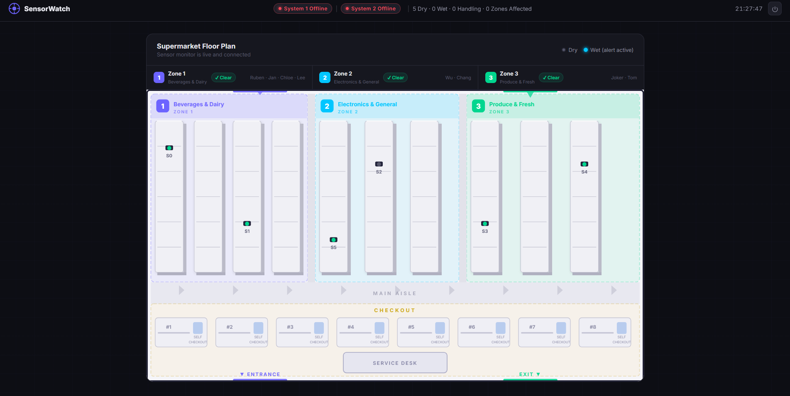
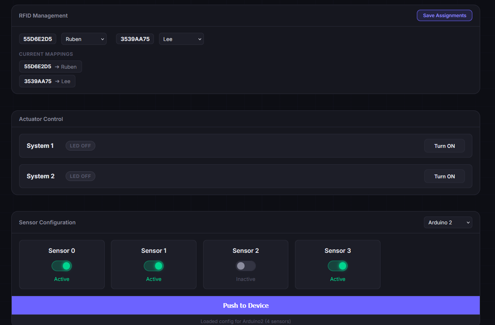

# AWS IoT SensorWatch Platform

Public-safe portfolio version of an AWS-connected IoT monitoring dashboard for supermarket-style wetness detection and response coordination.

The project demonstrates an edge-to-cloud data flow: Arduino-based sensors publish device readings to AWS-backed services, a browser dashboard polls API Gateway endpoints for live status, and operators can assign staff, manage RFID mappings, update device configuration, and control actuator states from a central interface.



## Why This Project Matters

Designed and implemented a cloud-connected IoT monitoring platform that integrates Arduino sensor devices, AWS API endpoints, dashboard visualisation, RFID-based staff response, actuator control, and device configuration workflows, supporting faster operational response to wet-floor or spill events.

## Architecture Relevance

- **Cloud-connected IoT workflow:** sensor devices, API Gateway endpoints, backend status/configuration services, and browser dashboard integration.
- **API-driven integration:** frontend polling, device configuration updates, threshold management, email notification calls, and actuator commands.
- **Operational visibility:** supermarket floor-plan view, zone status, system online/offline indicators, event audit log, and CSV exports.
- **Device management:** sensor enable/disable controls, threshold configuration, and push-to-device actions.
- **Security-aware public sharing:** AWS certificates, private keys, live endpoints, passwords, and personal emails are excluded from the public repository.

## Dashboard Features

- Live floor-plan view with dry, wet, handling, and inactive sensor states.
- Zone-level summary for affected supermarket areas.
- RFID staff assignment workflow for response tracking.
- Actuator control panel for two systems.
- Sensor configuration panel for Arduino devices.
- Threshold configuration workflow.
- Event audit table and CSV export.
- Public demo defaults when private AWS endpoints are not configured.



## Repository Layout

```text
.
|-- index.html                     # Main SensorWatch dashboard
|-- app.js                         # Dashboard state, API polling, staff assignment, device config
|-- map.js                         # SVG supermarket floor-plan rendering
|-- style.css                      # Dashboard styling
|-- simple-demo.html               # Earlier standalone sensor demo
|-- config.example.js              # Public-safe runtime config template
|-- WaterLevelReader/
|   `-- WaterLevelReader/
|       |-- platformio.ini
|       `-- src/main.cpp           # Arduino water-level reader prototype
|-- docs/
|   |-- architecture.md
|   |-- data-flow.md
|   |-- security-considerations.md
|   `-- assets/
`-- .gitignore
```

## Local Setup

For the public demo UI:

1. Open `index.html` in a browser.
2. Use the demo password from `config.example.js`: `demo-password`.
3. The dashboard loads in public-safe mode unless private AWS endpoints are configured.

For a private deployment:

1. Copy `config.example.js` to `config.js`.
2. Replace the placeholder API Gateway URLs with your private endpoints.
3. Set a private dashboard password and notification email.
4. Keep `config.js` local. It is intentionally ignored by Git.

```js
window.SENSORWATCH_CONFIG = {
    APP_PASSWORD: "replace-with-private-password",
    STATUS_API_BASE: "https://your-api-id.execute-api.region.amazonaws.com/sensor-status",
    EMAIL_API_BASE: "https://your-api-id.execute-api.region.amazonaws.com/send-email",
    ACTUATOR_API_BASE: "https://your-api-id.execute-api.region.amazonaws.com/prod/led-control",
    IOT_API_BASE: "https://your-api-id.execute-api.region.amazonaws.com/prod",
    DEFAULT_NOTIFICATION_EMAIL: "alerts@example.com"
};
```

## Firmware Prototype

The `WaterLevelReader` folder contains an Arduino MKR WiFi 1010 / PlatformIO prototype for reading multiple analogue water sensors, smoothing readings with a moving window, and classifying sensor states as dry, wet, or drying.

The public repository does not include AWS IoT certificates or live device credentials.

## Public Sharing Notes

- Real AWS IoT certificates and private keys are not committed.
- Live API Gateway URLs are not committed.
- Personal notification email addresses are replaced with placeholders.
- The frontend password is a demo value only and should not be treated as production authentication.
- Production deployments should enforce authentication, authorization, HTTPS, least-privilege IAM, certificate rotation, logging, and API rate limits.

## Portfolio Positioning

This repository is relevant to solution architecture and cloud engineering because it shows how edge sensor events, API-driven services, frontend dashboards, operational workflows, and device configuration can fit together into a user-facing IoT platform.
