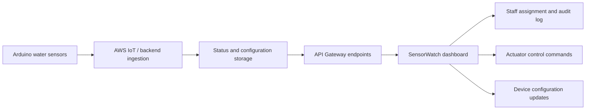

# Architecture Overview

SensorWatch is structured as an edge-to-cloud IoT monitoring workflow.

## Components

| Component | Responsibility |
| --- | --- |
| Arduino sensor devices | Read water sensors, classify local readings, and represent device-side state. |
| AWS IoT / backend services | Receive or store sensor status, RFID events, device configuration, thresholds, and actuator state. |
| API Gateway endpoints | Expose status, email, configuration, threshold, and actuator APIs to the dashboard. |
| Browser dashboard | Displays the supermarket floor plan, sensor states, zone summaries, RFID assignments, audit events, and device controls. |
| Staff response workflow | Maps RFID tags and employee assignments to sensor incidents. |

## High-Level Flow

## Design Notes

- The dashboard is intentionally decoupled from hardcoded live endpoints through `config.js`.
- Public demo mode keeps the UI visible without exposing private AWS infrastructure.
- The architecture separates operational visibility, device configuration, staff response, and actuator control into distinct UI panels.
